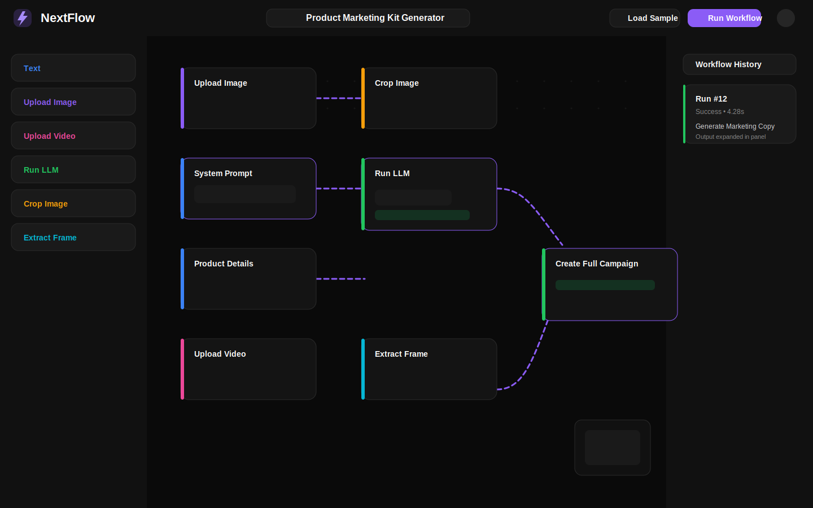

# NextFlow

Visual AI workflow builder for text, image, video, and LLM pipelines.

Live demo URL: add your Vercel deployment URL here after publishing, for example `https://your-project-name.vercel.app`



## Tech stack

| Layer | Technology | What it does |
| --- | --- | --- |
| App framework | Next.js 14 App Router | Routing, layouts, API routes, deployment target |
| Language | TypeScript strict mode | Type-safe editor, store, and API code |
| Auth | Clerk | Sign-in, sign-up, middleware protection, user avatar |
| Data | Prisma + Neon PostgreSQL | Workflow persistence, run history, node execution records |
| Canvas | React Flow | Drag-and-drop DAG editor, minimap, controls, connections |
| State | Zustand | Shared workflow editor state, undo/redo, save/load, execution state |
| Animation | Framer Motion | Node entry, sidebar transitions, history stagger, result reveal |
| AI | Google Gemini | LLM node execution |
| Async tasks | Trigger.dev | Remote execution path for LLM and media tasks |
| Media pipeline | Trigger.dev + Transloadit / FFmpeg-ready hooks | Crop-image and extract-frame execution path |

## Screenshot

The repo includes a preview asset at [`/public/nextflow-screenshot.svg`](/Users/arohijadhav/Desktop/NextFlow/public/nextflow-screenshot.svg) for the README and deployment pages.

## What the app does

NextFlow is a visual editor for DAG-based AI workflows. Users can:

- drag six node types onto a canvas
- connect valid inputs and outputs only
- save workflows automatically to PostgreSQL
- reload workflows from the database
- run the graph with dependency-aware parallel execution
- inspect workflow history and node-level outputs/errors
- load a sample product-marketing workflow
- export and import workflow JSON

## Architecture

### App structure

- [`app/(dashboard)/workflow/page.tsx`](/Users/arohijadhav/Desktop/NextFlow/app/(dashboard)/workflow/page.tsx): redirects authenticated users to their latest workflow or creates a new one
- [`app/(dashboard)/workflow/[id]/layout.tsx`](/Users/arohijadhav/Desktop/NextFlow/app/(dashboard)/workflow/[id]/layout.tsx): top navbar, left node palette, right workflow history
- [`app/(dashboard)/workflow/[id]/page.tsx`](/Users/arohijadhav/Desktop/NextFlow/app/(dashboard)/workflow/[id]/page.tsx): React Flow host page
- [`components/canvas/WorkflowCanvas.tsx`](/Users/arohijadhav/Desktop/NextFlow/components/canvas/WorkflowCanvas.tsx): canvas controls, drag/drop, import/export, connection handling
- [`components/nodes/`](/Users/arohijadhav/Desktop/NextFlow/components/nodes): node UIs for text, uploads, LLM, crop, and frame extraction
- [`components/sidebar/`](/Users/arohijadhav/Desktop/NextFlow/components/sidebar): node palette and workflow history panels
- [`lib/store/workflowStore.ts`](/Users/arohijadhav/Desktop/NextFlow/lib/store/workflowStore.ts): canonical client state, undo/redo, autosave, run updates
- [`lib/utils/dagExecutor.ts`](/Users/arohijadhav/Desktop/NextFlow/lib/utils/dagExecutor.ts): DAG build, validation, and execution grouping
- [`app/api/workflows`](/Users/arohijadhav/Desktop/NextFlow/app/api/workflows): workflow CRUD, ownership checks, run hydration
- [`app/api/execute/route.ts`](/Users/arohijadhav/Desktop/NextFlow/app/api/execute/route.ts): graph execution orchestration, Trigger.dev fallback path, run persistence
- [`trigger/tasks/`](/Users/arohijadhav/Desktop/NextFlow/trigger/tasks): Trigger.dev task definitions for LLM, crop image, and extract frame

### Data model

The database is multi-tenant by user:

- `User`
- `Workflow`
- `WorkflowRun`
- `NodeExecution`

Each workflow stores its `nodes` and `edges` as JSON, and each run stores node-level inputs, outputs, status, timing, and error details.

## How the DAG parallel execution engine works

The execution engine treats every workflow as a directed acyclic graph.

### 1. Graph build

[`lib/utils/dagExecutor.ts`](/Users/arohijadhav/Desktop/NextFlow/lib/utils/dagExecutor.ts) converts the current React Flow nodes and edges into adjacency maps:

- incoming dependencies for each node
- outgoing dependents for each node

### 2. Cycle detection

Before execution starts, the engine runs a Kahn-style topological validation pass. If a cycle is found, execution is rejected before any node work begins.

### 3. Parallel grouping

The engine computes execution levels:

- all nodes with zero unresolved dependencies become group 1
- when group 1 finishes, any newly unblocked nodes become group 2
- this repeats until the graph is exhausted

That produces an execution plan like:

```text
[
  ["upload-image-1", "upload-video-1", "text-1", "text-2", "text-3"],
  ["crop-image-1", "extract-frame-1"],
  ["llm-1"],
  ["llm-2"]
]
```

Every node inside the same group can run in parallel because none of them depend on each other.

### 4. Input resolution

For each node, the executor inspects incoming edges and resolves inputs from upstream node outputs:

- `Text` emits text
- `Upload Image` emits `imageUrl`
- `Upload Video` emits `videoUrl`
- `Crop Image` emits cropped `outputUrl`
- `Extract Frame` emits extracted frame `outputUrl`
- `Run LLM` emits generated text

Target handles determine where the upstream value lands:

- `system_prompt`
- `user_message`
- `images`
- `image_url`
- `video_url`
- `timestamp`

### 5. Execution persistence

The executor writes:

- one `WorkflowRun` record for the run
- one `NodeExecution` record per node
- live status transitions: `pending -> running -> success/failed`
- node inputs, outputs, execution time, and error text

### 6. Trigger.dev integration

The execution route attempts Trigger.dev first when Trigger credentials are configured:

- `llm-execute`
- `crop-image`
- `extract-frame`

For local development resilience, the route falls back to inline execution logic when Trigger.dev is unreachable so the editor still works during development.

## Setup guide

### 1. Clone and install

```bash
git clone <your-repo-url>
cd NextFlow
npm install
```

### 2. Configure environment variables

Copy the template and fill in the real values:

```bash
cp .env.example .env.local
```

Required variables:

- `DATABASE_URL`
- `NEXT_PUBLIC_CLERK_PUBLISHABLE_KEY`
- `CLERK_SECRET_KEY`
- `GOOGLE_GENERATIVE_AI_API_KEY`
- `TRIGGER_API_KEY`
- `TRIGGER_API_URL`
- `NEXT_PUBLIC_TRIGGER_PROJECT_ID`
- `TRANSLOADIT_AUTH_KEY`
- `TRANSLOADIT_AUTH_SECRET`

### 3. Prepare the database

```bash
npx prisma generate
npx prisma migrate dev
```

### 4. Run the app

```bash
npm run dev
```

Open [http://localhost:3000](http://localhost:3000).

### 5. Sign in and open the editor

After authentication, `/workflow` redirects to the latest workflow for the signed-in user or creates a new one automatically.

## Local development checks

```bash
npm run type-check
npm run build
```

Optional:

```bash
npm run lint
```

## Workflow behavior

### Node types

- `Text`: author static text and prompts
- `Upload Image`: upload an image and pass it downstream
- `Upload Video`: upload a video and pass it downstream
- `Run LLM`: select Gemini model and generate text
- `Crop Image`: crop an upstream image using percentage coordinates
- `Extract Frame`: capture a video frame at a timestamp

### Persistence

- workflow name, nodes, and edges auto-save after edits
- the current workflow restores on refresh
- run history restores from PostgreSQL
- export/import works with JSON payloads containing `name`, `nodes`, and `edges`

### Keyboard shortcuts

- `Ctrl/Cmd + S`: save workflow
- `Ctrl/Cmd + Z`: undo
- `Ctrl/Cmd + Shift + Z`: redo
- `Ctrl/Cmd + A`: select all nodes
- `Delete` or `Backspace`: delete selected nodes
- `Escape`: clear selection

## Sample workflow

The built-in sample loads the `Product Marketing Kit Generator` graph with these edges:

- `Upload Image -> Crop Image`
- `Text #1 -> LLM #1 system_prompt`
- `Text #2 -> LLM #1 user_message`
- `Crop Image -> LLM #1 images`
- `Upload Video -> Extract Frame`
- `LLM #1 output -> LLM #2 user_message`
- `Extract Frame -> LLM #2 images`
- `Text #3 -> LLM #2 system_prompt`

## Deployment on Vercel

### 1. Create the Vercel project

- import the repository into Vercel
- set the framework preset to Next.js

### 2. Add environment variables in Vercel

Use the same values from `.env.local`:

- `DATABASE_URL`
- `NEXT_PUBLIC_CLERK_PUBLISHABLE_KEY`
- `CLERK_SECRET_KEY`
- `GOOGLE_GENERATIVE_AI_API_KEY`
- `TRIGGER_API_KEY`
- `TRIGGER_API_URL`
- `NEXT_PUBLIC_TRIGGER_PROJECT_ID`
- `TRANSLOADIT_AUTH_KEY`
- `TRANSLOADIT_AUTH_SECRET`

### 3. Production checklist

- run `npx prisma migrate deploy` in the deployment pipeline
- ensure Clerk redirect URLs match the production domain
- ensure Neon allows the production deployment to connect
- configure Trigger.dev against the production app URL
- configure Transloadit credentials in Vercel

## Notes

- `.env.local` is ignored by git through [`.gitignore`](/Users/arohijadhav/Desktop/NextFlow/.gitignore)
- the README preview asset is intentionally committed so the repo always renders with a visual preview
- the current repo is ready for local development and Vercel configuration, but the actual public deployment URL still needs to be created in your Vercel account
